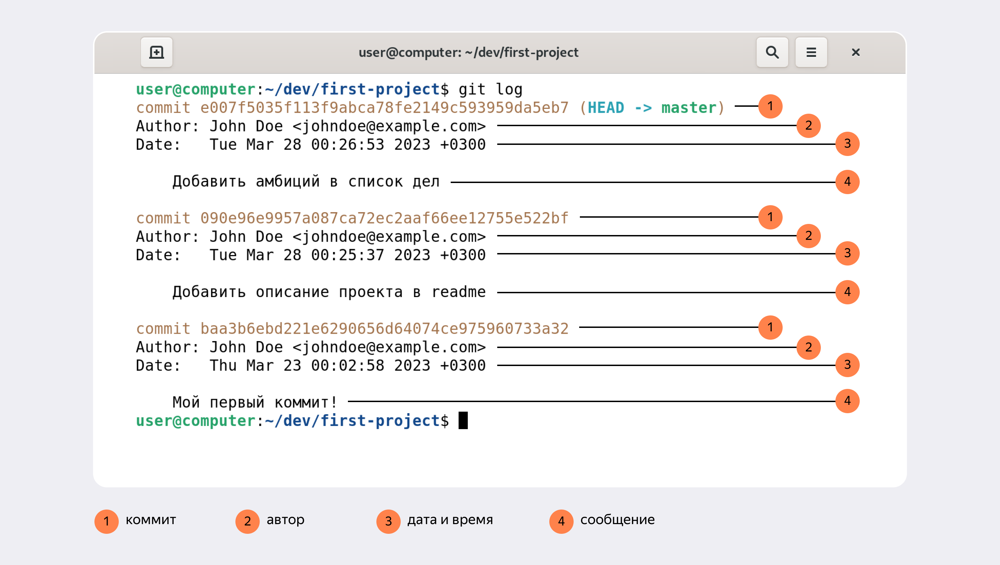
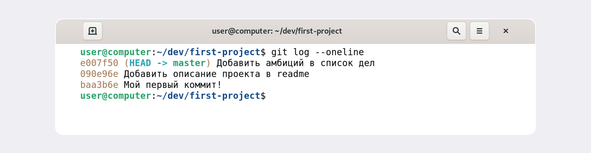
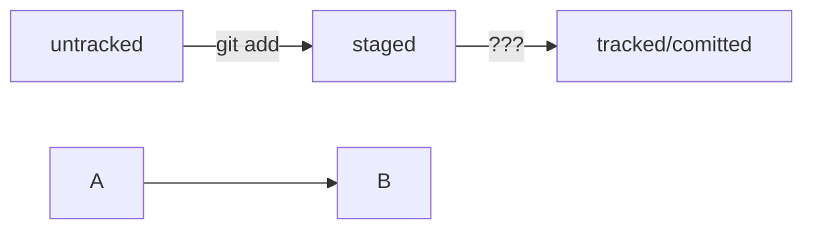

# git-cheat-sheet

## Репозиторий со шпаргалкой по GIT

### Хеш - идентификатор коммита

* Хэш коммита - идентификатор коммита, полученный с помощью алгоритма SHA-1.
* Хэш обладает свойством: если хоть что-то в исходных данных поменяется, хеш тоже изменится.
* Git хранит таблицу соответствий хеш → информация о коммите в служебных файлах .git.

---

### Команда ```git log```

После вызова ```git log``` появляется список коммитов с их описанием.



Вот из каких элементов состоит описание:
1. Строка из цифр и латинских букв после слова commit — это уже знакомый вам хеш коммита.
2. Author — имя автора и его электронная почта.
3. Date — дата и время создания коммита.
4. Сообщение к коммиту.

Также есть cокращённый лог ```git log --oneline``` - список коммитов с описанием, содержит только первые несколько символов хеша и комментарии. 
Вывод будет примерно таким:



---

### HEAD - указатель на последний (самый новый) коммит

Когда вы делаете коммит, Git обновляет refs/heads/master (служебный файл) — записывает в него хеш последнего коммита. 
Получается, что HEAD тоже обновляется, так как ссылается на refs/heads/master.

При работе с Git указатель HEAD используется часто, вместо хеша последнего коммита можно просто написать слово HEAD.

---

